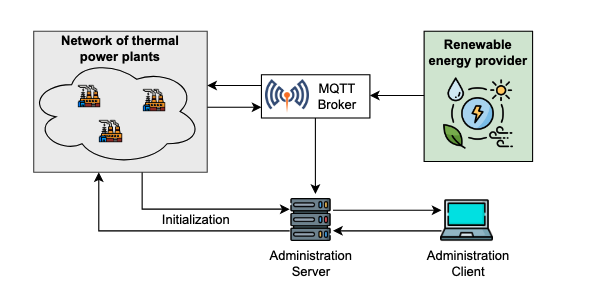

# DESM - Distributed Energy Supply Management

A distributed system simulation for managing energy supply networks, featuring peer-to-peer coordination between thermal power plants overseen by a renewable energy provider.



## Project Overview

DESM simulates an energy supply network where a renewable energy provider publishes energy requests that are fulfilled by a network of thermal power plants. The system demonstrates key concepts in distributed systems including peer-to-peer communication, distributed elections, and real-time sensor data management.

## System Architecture

The system consists of four main components, each running as an **independent process** with its own execution:

- **Renewable Energy Provider**: Publishes energy requests every 10 seconds (5,000-15,000 kWh)
- **Thermal Power Plants**: Peer-to-peer network that competes to fulfill energy requests
- **Administration Server**: REST server managing plant registration and pollution statistics
- **Administration Client**: CLI interface for querying system statistics

## Technology Stack

### Frameworks and Libraries

| Component | Technology |
|-----------|------------|
| Build System | Gradle |
| REST Server | Spring Boot with Jersey |
| Inter-plant Communication | gRPC |
| Messaging | MQTT (Eclipse Paho) with Mosquitto Broker |
| Serialization | Protocol Buffers, JSON |

### Communication Protocols

- **gRPC**: Used for synchronous peer-to-peer communication between thermal power plants during the election process
- **MQTT**: Asynchronous publish/subscribe messaging for energy requests and sensor data
- **REST/HTTP**: Client-server communication between plants/clients and the administration server

## Multithreading Architecture

### Thermal Power Plant Threads

Each thermal power plant process manages multiple concurrent threads:

1. **MQTT Subscriber Thread**: Listens for energy requests from the renewable energy provider
2. **gRPC Server Thread**: Handles incoming election messages from other plants
3. **Sensor Simulator Thread**: Generates pollution measurements at regular intervals
4. **Statistics Reporter Thread**: Sends aggregated sensor data to the administration server every 10 seconds
5. **Energy Production Thread**: Simulates energy production when the plant wins a bid

### Administration Server Threads

- **REST Request Handler Threads**: Managed by Spring Boot for concurrent client requests
- **MQTT Subscriber Thread**: Receives pollution statistics from all plants

### Synchronization Requirements

All shared data structures require proper synchronization:

- Plant registry (concurrent registration/deregistration)
- Pollution statistics buffer (concurrent read/write)
- Sensor measurement buffer (producer-consumer pattern)
- Election state management (distributed coordination)

**Note**: Synchronization primitives (locks, semaphores, shared buffers) must be implemented from scratch for educational purposes.

## Distributed Election Algorithm

### Chang-Roberts Ring Algorithm

The system implements the Chang-Roberts algorithm for leader election in a logical ring topology.

#### Election Trigger

An election begins when any plant receives an energy request from the renewable energy provider.

#### Election Criteria

The winning plant is determined by:

1. **Availability**: Plant must not be currently fulfilling another request
2. **Lowest Price**: Each plant generates a random bid in the range [0.1, 0.9] $/kWh
3. **Tie-breaker**: If prices are equal, the plant with the highest ID wins

#### Algorithm Flow

1. Each plant generates its bid upon receiving an energy request
2. Plants forward election messages around the ring via gRPC
3. Messages contain the current best candidate (price + ID)
4. Each plant compares its bid with the received message and forwards the better offer
5. When a message completes the ring, the winner is determined
6. The winning plant proceeds to fulfill the energy request

#### Dynamic Network Handling

The algorithm must handle:

- New plants joining during an ongoing election
- Plants participating in elections immediately after registration
- Ring topology reconstruction when plants join/leave

## Sensor Data Management

### Sliding Window Algorithm

Pollution sensor data is processed using a sliding window technique:

- **Window Size**: 8 measurements
- **Overlap Factor**: 50%
- **Output**: Average of each window sent to the administration server

### Buffer Interface

The sensor buffer implements a producer-consumer pattern:

- `void add(Measurement m)` - Called by the simulator thread
- `List<Measurement> readAllAndClean()` - Called by the statistics reporter

### Data Flow

1. Simulator generates CO2 measurements with timestamps
2. Measurements are added to the buffer
3. When buffer reaches 8 measurements, average is computed
4. Buffer shifts by 4 measurements (50% overlap)
5. Averages are collected and sent to the server every 10 seconds

## MQTT Topics

| Topic | Publisher | Subscriber | Content |
|-------|-----------|------------|---------|
| Energy Requests | Renewable Energy Provider | Thermal Power Plants | kWh amount + timestamp |
| Pollution Data | Thermal Power Plants | Administration Server | Plant ID + averages + timestamp |

## REST API Endpoints

### Plant Management

- **POST /plants** - Register a new thermal power plant
  - Request: ID, address, port
  - Response: List of existing plants (ID, address, port)

### Statistics Queries

- **GET /plants** - List all active thermal power plants
- **GET /statistics** - Get average CO2 emissions between timestamps t1 and t2

## Key Implementation Considerations

### Concurrency Challenges

1. **Election during energy production**: Plants must handle new elections while fulfilling requests
2. **Concurrent plant registration**: Server must safely update the plant registry
3. **Statistics collection**: Simultaneous read/write access to pollution data
4. **Ring topology updates**: Dynamic restructuring as plants join the network

### Parallel Communication

All broadcast communications between plants must be executed in parallel, not sequentially. This is critical for:

- Announcing new plant arrivals
- Distributing election results
- Handling controlled plant exits (optional part)

### Error Handling

- Validate user input parameters
- Handle all exceptions gracefully
- Manage network failures and timeouts
- Detect and recover from partial failures (optional: uncontrolled exit)

## Configuration

### MQTT Broker

- **Address**: `tcp://localhost:1883`
- **Implementation**: Mosquitto

### Default Ports

- Administration Server: Configurable (typically 8080)
- Plant gRPC: Specified at startup
- MQTT: 1883

## Project Structure

```
desm/
├── AdministrationClient/          # Spring Boot REST server
├── AdministrationServer/          # CLI client application
├── RenewableEnergyProvider/    # Energy request publisher
├── ThermalPowerPlant/         # Power plant process
├── Common/               # Shared models and utilities
└── src/                # Protocol Buffer definitions
```

---


*This project is part of the Distributed and Pervasive Systems Lab Course - May 2025*

